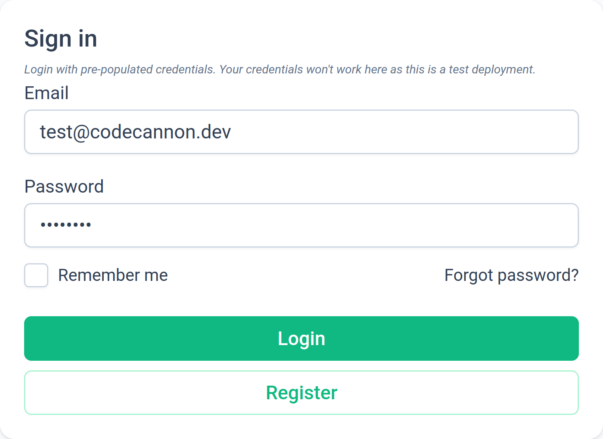
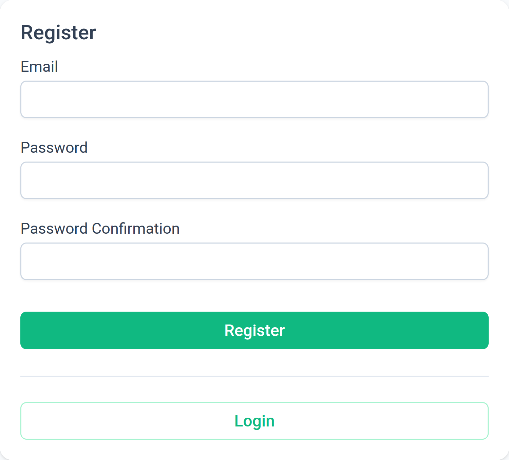
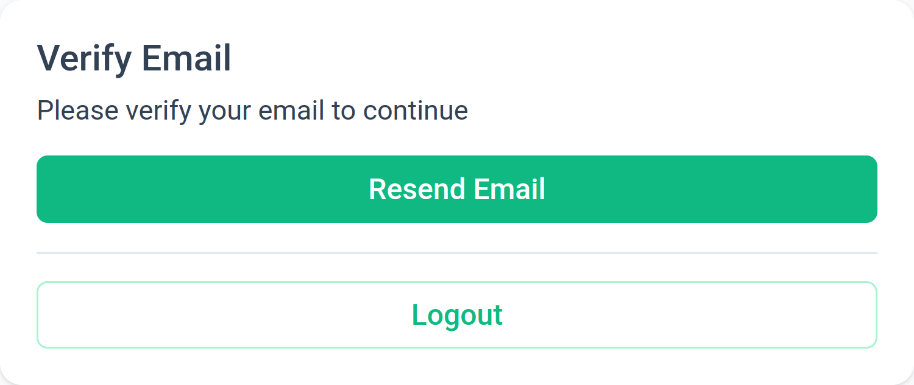
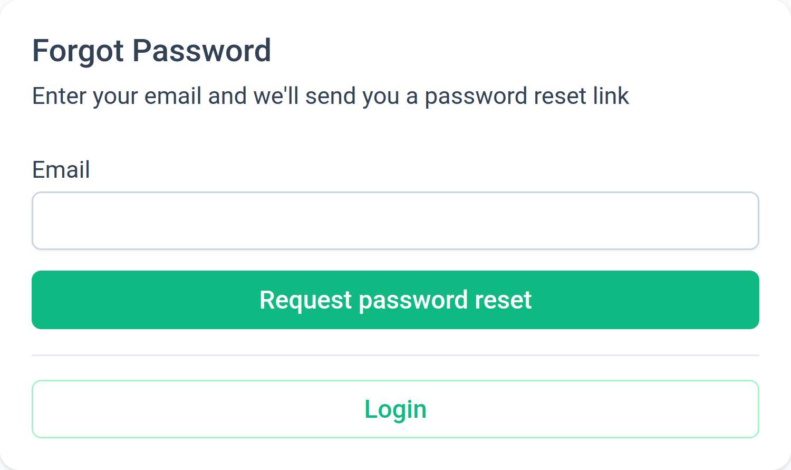
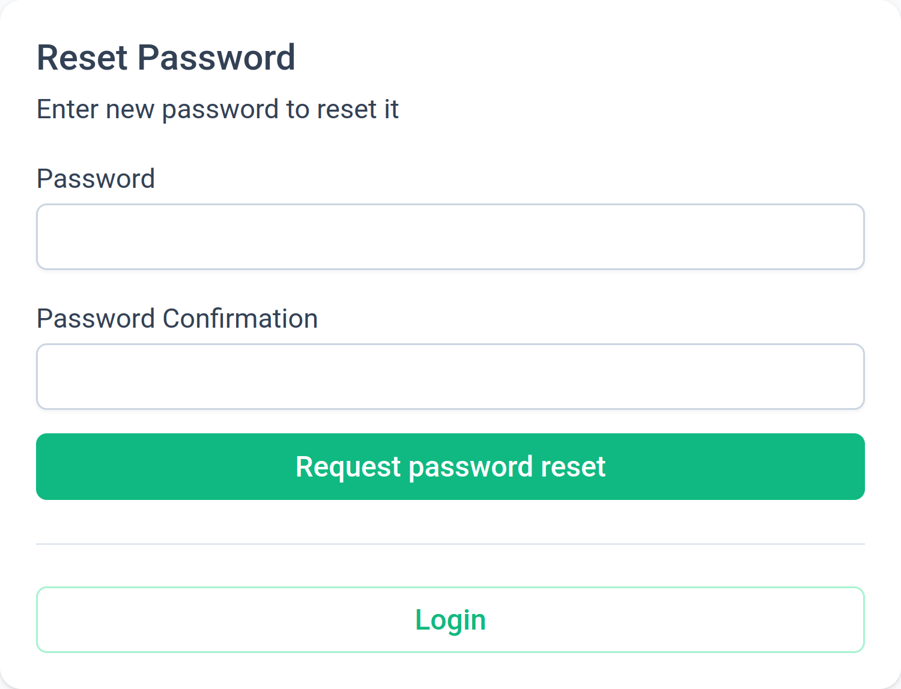

# Login/Registration

Codecannon apps ship with a fully functional Login and Registration system.
The system is built using Laravel Sanctum, Fortify and a bit of custom
implementation for the backend and a custom implementation on the frontend.

- See also
  - [Laravel Sanctum Documentation](https://laravel.com/docs/11.x/sanctum)
  - [Laravel Fortify Documentation](https://laravel.com/docs/11.x/fortify)
  - [Authentication Documentation](/essentials/authentication)
  - [User Management Documentation](/essentials/user-management)

## Login page

The login page source code can be found in `ui/src/views/Auth/Login.vue`.

The login page is the first page the users land on and is the page where users
are redirected when logged out.

It's a basic login page with backend form validation and links for registration
and password reset.

## Registration page

The registration page source code can be found in `ui/src/views/Auth/Register.vue`.

The registration page is where users can create a new account.

It's a basic registration page with backend form validation and links for login
and password reset.

After a user registers, they will be redirected to the email verification page,
prompting them to verify their email address.

## Email verification page

The email verification page source code can be found in
`ui/src/views/Auth/VerifyEmail.vue`.

The email verification page is where users are redirected to after registering
a new account.

It's a basic page with a message prompting the user to check their email for a
verification link.

It doubles as the page where users are redirected to when they click the
verification link in their email.

## Forgot password page

The forgot password page source code can be found in `ui/src/views/Auth/ResetPassword.vue`.

The forgot password page is where users are redirected to when they click the
`Forgot password?` link on the login page.

It's a basic page with backend form validation and links for login and registration.

A user is prompted to enter their email address, and if the email address is
valid, they will receive an email with a password reset link.

## Reset password page

The reset password page source code can be found in `ui/src/views/Auth/UpdatePassword.vue`.

The reset password page is where users are redirected to after clicking the
password reset link in their email.

It's a basic page with backend form validation and links for login and registration.

A user is prompted to enter a new password and confirm it.

## Logout

The logout functionality can be found in `ui/src/router/index.ts`.

It's a simple route that calls the `auth.logout()` method in the `Auth` store.

When a user logs out, they are redirected to the login page.
