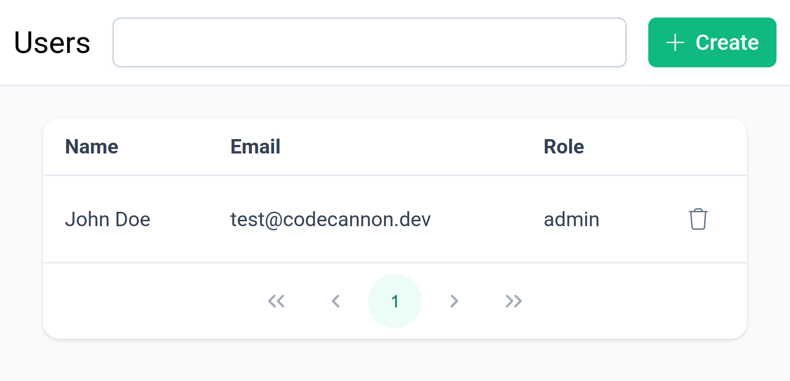
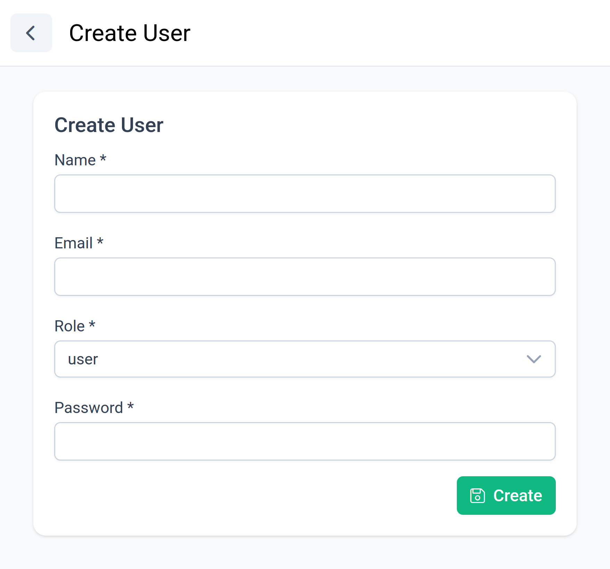
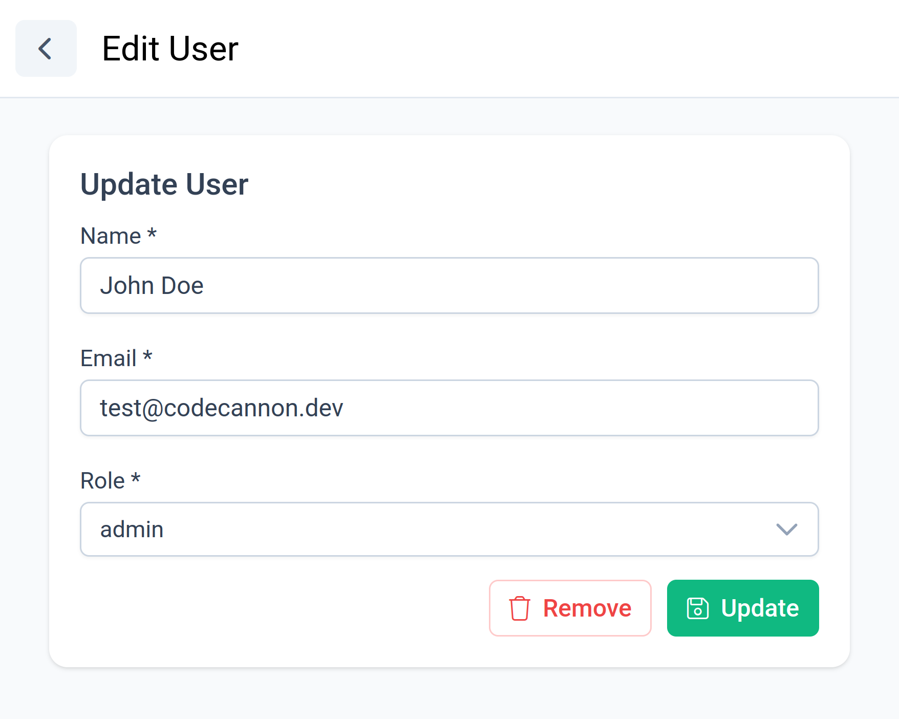
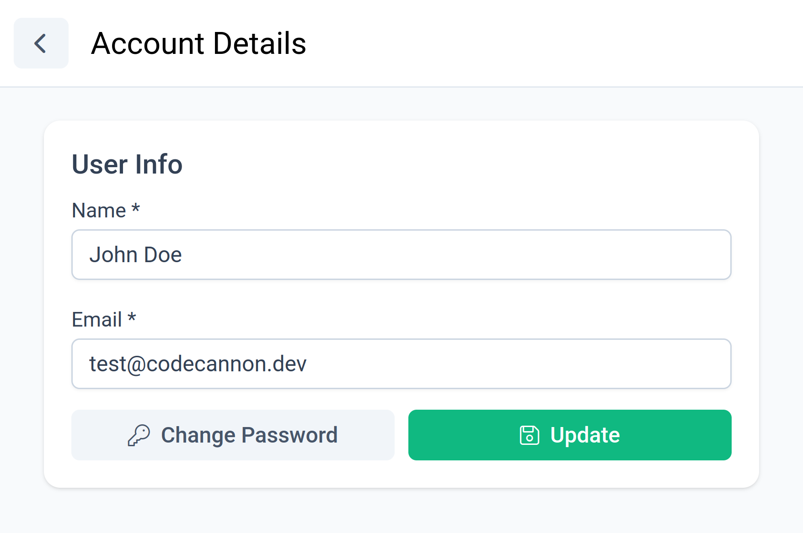

# User management

The frontend provides a few standard views for user management.

If you're interested in the authentication implementation of Codecannon apps,
you can read the [Authentication Documentation](/essentials/authentication).

## User Module UI

The `User` module ships with a standard set of views with a few caveats.

- The `User` module is only accessible to users with role `admin`.
- The `User` create view allows admins to create users and set their password.
- The `User` edit view allows admins to update user info and their password.

## User Profile UI

Codecannon apps also include a `User Details` view for users to change their
user information.

