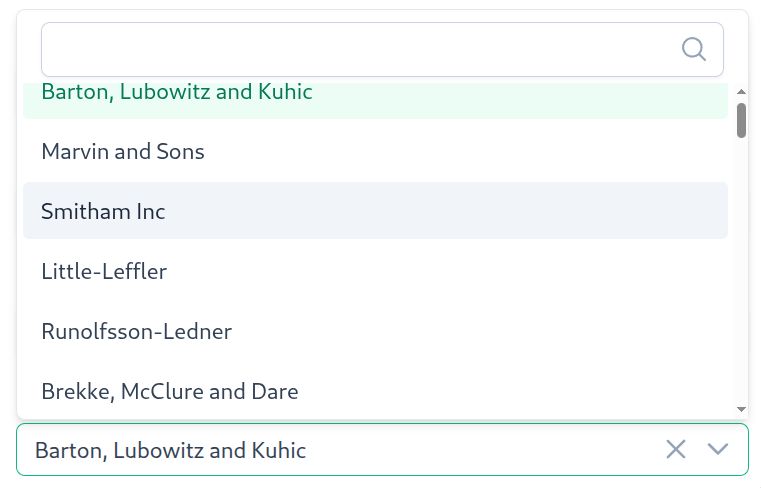
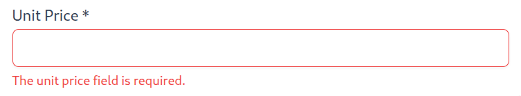

# Components

codecannon apps create a set of reusable components that can be used to build
the frontend of your application. These components are designed to be used
with Vue 3 and PrimeVue.

## `ModelSelect`

`ModelSelect` is a component that allows the user to select a entity from a list
of entities for a particular model. The list of models is fetched from the server.

The `ModelSelect` component is a wrapper around the PrimeVue `Select` commponent,
so you can pass the `Select` props to the `ModelSelect` component.

```vue
<template>
  <ModelSelect
      v-model="form.app_id"
      :api="new UsersApi()"
      option-label="name" />
</template>

<script>
import { ModelSelect } from '@/components'
import AppsApi from '@/models/Users/Api'
```



- See also
  - [API - `ModelSelect`](/api/frontend/model-select)

## `FormInput`

`FormInput` is a form input wrapper commponent that allows you to easily add
a label and error text to a form input. It also allows you to mark an input as
required.

```vue
<template>
  <FormInput
      label="Email"
      required
      :errors="formErrors.email">
      <InputText v-model="form.email" />
  </FormInput>

</template>

<script>
import FormInput from '@/components/FormInput.vue'
import InputText from 'primevue/inputtext'
```



- See also
  - [API - `FormInput`](/api/frontend/form-input)

## `Container`

`Container` is a wrapper component that allows you to add default sizing to your
app views.

```vue
<template>
	<div class="ui-container">
		<slot></slot>
	</div>
</template>

<style scoped lang="scss">
.ui-container {
	width: 100%;
	padding: 24px 10%;
}
</style>
```

When a `Container` is placed directly after another `Container`, the second one
will automatically have its top padding removed to prevent double spacing.

## `Header`

`Header` is a component that provides a standardized header bar for views. It displays
a title, includes a mobile navigation menu button, and provides a slot for action
buttons. The component is sticky and provides consistent styling across all views.
It also includes an integrated loading indicator that can be controlled via the
`isLoading` prop.

The Header component is a shared component located in `@/components/Header.vue`
and is used in both List and Edit views.

### Props

- **`title`** (required, `string`): The title text to display in the header.

- **`isLoading`** (optional, `boolean`): Controls whether the integrated loading
  indicator is visible. When `true`, a progress bar appears at the bottom of the
  header. When `false` or `undefined`, the loader is hidden. The loader includes a
  100ms delay before appearing to prevent flicker for fast operations.

### Features

- **Sticky Positioning**: The header is positioned sticky at the top of the view,
  remaining visible when scrolling.

- **Mobile Menu Button**: On screens smaller than 1500px, a hamburger menu button
  appears that opens the navigation overlay.

- **Slot for Actions**: The component provides a default slot where you can place
  action buttons (like "Create" in list views).

- **Integrated Loading Indicator**: The header includes a `HeaderLoader` component
  that displays a progress bar at the bottom of the header when loading operations
  are in progress. This is controlled via the `isLoading` prop.

- **Dark Mode Support**: The header automatically adapts to dark mode preferences
  using CSS media queries.

### Usage Example

```vue
<template>
	<Header
		title="Edit Post"
		:is-loading="loaders.size > 0" />
	<Container class="edit">
		<Form
			:id="route.params.id as string"
			@start-loading="loaders.add('form')"
			@stop-loading="loaders.delete('form')" />
	</Container>
</template>

<script setup lang="ts">
import { reactive } from 'vue'
import { useRoute } from 'vue-router'
import Header from '@/components/Header.vue'
import Container from '@/components/Container.vue'
import Form from './components/Form.vue'

const route = useRoute()
const loaders = reactive(new Set<string>())
</script>
```

- See also
  - [API - `Header`](/api/frontend/header)
  - [Frontend - `HeaderLoader`](/frontend/components#headerloader)
  - [Generated Files - List View](/generated-files/frontend/views/list)
  - [Generated Files - Edit View](/generated-files/frontend/views/edit)

## `ListSearch`

`ListSearch` is a search input component designed for use with `ListState` instances.
It provides a debounced search functionality that automatically queries the list state
when the user types, with a clear button to reset the search.

The component integrates seamlessly with PrimeVue's `IconField`, `InputIcon`, and
`InputText` components to provide a consistent search experience.

```vue
<template>
	<Container>
		<ListSearch
			:list-state="listState"
			placeholder="Search Posts" />
	</Container>
	<Container>
		<ApiTable :list-state="listState">
			<!-- Table columns -->
		</ApiTable>
	</Container>
</template>

<script setup lang="ts">
import { onBeforeMount } from 'vue'
import Container from '@/components/Container.vue'
import ListSearch from '@/components/ListSearch.vue'
import useApiTable from '@/components/Table/useApiTable'
import { usePostListState } from '@/models/Post/States'

const listState = usePostListState()
const { ApiTable, Column } = useApiTable(listState)

onBeforeMount(() => {
	listState.getList()
})
</script>
```

### Props

- **`listState`** (required, `ListState<any, any, any>`): The list state instance
  to search. The component will call `listState.getList()` with the search parameter
  when the user types.

- **`placeholder`** (optional, `string`): The placeholder text to display in the
  search input. Defaults to an empty string.

### Features

- **Debounced Search**: The search is debounced by 300ms, so the API is only called
  after the user stops typing for 300ms. This reduces unnecessary API calls.

- **Enter Key Support**: Users can press Enter to immediately trigger the search
  without waiting for the debounce timer.

- **Clear Button**: When there's text in the search input, a clear button (X icon)
  appears that allows users to quickly reset the search and return to the full list.

- **Automatic Pagination Reset**: When searching, the component automatically resets
  to page 1, ensuring users see results from the beginning of the filtered list.

- See also
  - [API - `ListSearch`](/api/frontend/list-search)
  - [Generated Files - List View](/generated-files/frontend/views/list)
  - [API - `ListState`](/api/frontend/list-state)

## `HeaderLoader`

`HeaderLoader` is a component that displays a loading indicator. It can be used on its
 own or as the integrated `Header` component loader.

The component has a height of 2px and a negative bottom margin of -2px, allowing it to
seamlessly integrate with headers without adding extra spacing.

The loader includes a 100ms delay before appearing, so fast requests (completing in less
than 100ms) won't trigger the loader. This prevents unnecessary visual flicker for quick
operations. Once loading stops, the loader hides immediately with no delay.

### Props

- **`isLoading`** (optional, `boolean`): Controls whether the loader is visible.
  When `true`, the loader is displayed. When `false` or `undefined`, the loader is hidden.

- See also
  - [Frontend - Header](/frontend/components#header)
  - [API - HeaderLoader](/api/frontend/header-loader)

## `FormContainer`

The `FormContainer` component is a wrapper component that adds forms the ability
to be rendered either as a card or as a dialog.

```vue
<template>
	<Dialog
		v-if="asDialog"
		:visible="visible"
		modal
		class="form-container"
		:header="title"
		@update:visible="emit('close')">
		<slot />
	</Dialog>
	<Card
		v-else
		border
		class="form-container">
		<template #title>
			{{ title }}
		</template>
		<template #content>
			<slot />
		</template>
	</Card>
</template>

<script setup lang="ts">
import Card from 'primevue/card'
import Dialog from 'primevue/dialog'

const emit = defineEmits<{
	(e: 'close'): void
}>()

withDefaults(
	defineProps<{
		asDialog?: boolean
		visible?: boolean
		title: string
	}>(),
	{
		asDialog: false,
		visible: false,
	},
)
</script>

<style lang="scss">
.form-container {
	width: 100%;
	max-width: 600px;
}
</style>
```

### Usage as dialog

The `FormContainer` component can be used as a dialog by setting the `asDialog`
prop to `true`. The dialog will be displayed when the `visible` prop is set to
`true`.

```vue
<template>
    <FormContainer
        asDialog
        :visible="visible"
        title="Create User"
        @update:visible="visible = $event">
        <!-- Form content -->
    </FormContainer>
</template>

<script setup lang="ts">
import { ref } from 'vue'
import FormContainer from '@/components/FormContainer.vue'

const visible = ref(false)
</script>
```

By changing the `visible` prop, you can control the visibility of the dialog.

You can listen to the visible status of the `FormContainer` component by listening
to the `update:visible` event.

### Usage as card

The `FormContainer` component can be used as a card by setting the `asDialog`
prop to `false`. The card will be displayed with the title provided.

```vue
<template>
    <FormContainer
        title="Create user">
        <!-- Form content -->
    </FormContainer>
</template>
```

## `ApiTable`

The `ApiTable` component is designed for displaying paginated API data. It
leverages PrimeVue components (such as `DataTable`, `Paginator`, and `Card`) to
render a fully functional table with pagination support. By providing a listState
instance, the component can manage data fetching, loading states, and pagination
interactions automatically.

> **Important:** For proper TypeScript type inference in Column slot props, always
> use the [`useApiTable`](/api/frontend/use-api-table) composable to import table
> components instead of importing them directly. This ensures that `columnProps.data`
> is properly typed in your templates.

```vue
<template>
	<ApiTable
		:list-state="listState">
		<Column
			field="title"
			header="Title" />
		<Column
			field="body"
			header="Body" />
	</ApiTable>
</template>

<script setup lang="ts">
import { onBeforeMount } from 'vue'
import useApiTable from '@/components/Table/useApiTable'
import { usePostListState } from '@/models/Post/States'

const listState = usePostListState()
const { ApiTable, Column } = useApiTable(listState)

onBeforeMount(() => {
	listState.getList()
})
</script>
```

The example above is how the table is used in [List](/generated-files/frontend/views/list)
views. The `ApiTable` component is used to display a list of posts. The `Column`
component is used to define the columns of the table. The `ApiTableLinkButton` and
`ApiTableRemoveButton` components are used to add action buttons to table rows.

- See also
  - [API - `useApiTable`](/api/frontend/use-api-table) - For type-safe table components

### Table data

The `ApiTable` component requires a `listState` prop to be passed in. The
`listState` prop is an instance of the `ListState` class. It allows the `ApiTable`
component to manage data fetching, loading states, and pagination interactions.

The data is not automatically loaded on mount, so you have to call the `getList`
method on the `listState` instance to fetch the data. This is so you can control
when the data is fetched.

Since the API table works with `ListState`, all requests will be made with the
default parameters or saved queries on the `ListState` instance.

- See also
  - [Frontend - States](/frontend/states)
  - [API - `ListState`](/api/frontend/list-state)

### Pagination

The `ApiTable` component uses the `Paginator` component from PrimeVue to handle
pagination. The `Paginator` component is automatically rendered at the bottom of
the table. The `ApiTable` automatically handles pagintation state using the
`ListState` instance provided.

### Loading Indicator

The `ApiTable` component automatically displays a loading indicator when data is being
fetched. The loading indicator uses the `HeaderLoader` component and is positioned
directly under the table header row.

The loading state is determined by:
- The `loading` prop, if explicitly provided (defaults to `undefined`)
- Otherwise, the `listState.isLoading.value` from the `ListState` instance

- See also
  - [Frontend - `HeaderLoader`](/frontend/components#headerloader) - The loading indicator component
  - [Frontend - `ListState`](/frontend/states) - State management and loading for tables

### Row click

The `ApiTable` component emits a `row-click` event when a row is clicked. The
event is emitted with the row data as the payload. This allows you to handle
click events on rows in the table.

```vue
<template>
	<ApiTable
		:list-state="listState"
		@row-click="openDetails">
		<Column
			field="title"
			header="Title" />
		<Column
			field="body"
			header="Body" />
	</ApiTable>
</template>

<script setup lang="ts">
import { useRouter } from 'vue-router'
import useApiTable from '@/components/Table/useApiTable'
import { usePostListState } from '@/models/Post/States'
import type { Post } from '@/models/Post/Model'

const listState = usePostListState()
const router = useRouter()
const { ApiTable, Column } = useApiTable(listState)

function openDetails(item: { data: Post }) {
	router.push({ name: 'posts-edit', params: { id: item.data.id } })
}
</script>
```

### Selection

The `ApiTable` component supports row selection. You can enable row selection by
setting the `selectionMode` prop to `'single'` or `'multiple'`. The selected rows
are stored in the `selected` prop as a reactive set.

You can pass a `selected` prop to the `ApiTable` component to control the selected
rows from the parent component.

```vue
<template>
    <ApiTable
        :list-state="listState"
        :selected="selected"
        selection-mode="multiple">
        <Column
            field="title"
            header="Title" />
        <Column
            field="body"
            header="Body" />
    </ApiTable>
</template>

<script setup lang="ts">
import { ref } from 'vue'
import useApiTable from '@/components/Table/useApiTable'
import { usePostListState } from '@/models/Post/States'
import type { Post } from '@/models/Post/Model'

const listState = usePostListState()
const { ApiTable, Column } = useApiTable(listState)
const selected = ref<Set<Post>>(new Set())
</script>
```

### Loading

The `ApiTable` component automatically handles loading states. The `loading`
prop can be used to override the loading state of the table should you need it.

If the `loading` prop is set to `true`, the table will display a loading indicator.

If the `listState` loading state is set to `true`, the table will display a loading
indicator regardless of the `loading` prop.

```vue
<template>
    <ApiTable
        :list-state="listState"
        :loading="loading">
        <Column
            field="title"
            header="Title" />
        <Column
            field="body"
            header="Body" />
    </ApiTable>
</template>

<script setup lang="ts">
import { ref } from 'vue'
import useApiTable from '@/components/Table/useApiTable'
import { usePostListState } from '@/models/Post/States'

const listState = usePostListState()
const { ApiTable, Column } = useApiTable(listState)
const loading = ref(false)
</script>
```

## `ApiTableRemoveButton`

The `ApiTableRemoveButton` component is a button that allows you to remove a row
from the table. The component is designed to be used inside the `ApiTable` component.

```vue
<template>
	<ApiTable
		:list-state="listState">
		<Column
			field="title"
			header="Title" />
		<Column
			field="body"
			header="Body" />
		<Column header="">
			<template #body="slotProps">
				<ApiTableRemoveButton :item="slotProps.data" />
			</template>
		</Column>
	</ApiTable>
</template>

<script setup lang="ts">
import { onBeforeMount } from 'vue'
import useApiTable from '@/components/Table/useApiTable'
import { usePostListState } from '@/models/Post/States'

const listState = usePostListState()
const { ApiTable, Column, ApiTableRemoveButton } = useApiTable(listState)

onBeforeMount(() => {
	listState.getList()
})
</script>
```

The `ApiTableRemoveButton` component requires an `item` prop to be passed in. The
`item` prop is the entity that the button will remove via the API.

The user will be prompted with a confirmation dialog before the item is removed.

- See also
  - [API - `ApiTableRemoveButton`](/api/frontend/api-table-remove-button)

## `ApiTableLinkButton`

The `ApiTableLinkButton` component is a button that creates a link to navigate to
another page. The component is designed to be used inside the `ApiTable` component
to add edit or view links to table rows.

```vue
<template>
	<ApiTable
		:list-state="listState">
		<Column
			field="title"
			header="Title" />
		<Column
			field="body"
			header="Body" />
		<Column
			:style="{ maxWidth: '112px', width: '112px' }"
			header="">
			<template #body="columnProps">
				<ApiTableLinkButton
					:to="{ name: 'posts-edit', params: { id: columnProps.data.id } }"
					icon="fal fa-pen-to-square" />
			</template>
		</Column>
	</ApiTable>
</template>

<script setup lang="ts">
import { onBeforeMount } from 'vue'
import useApiTable from '@/components/Table/useApiTable'
import { usePostListState } from '@/models/Post/States'

const listState = usePostListState()
const { ApiTable, Column, ApiTableLinkButton } = useApiTable(listState)

onBeforeMount(() => {
	listState.getList()
})
</script>
```

The `ApiTableLinkButton` component requires two props:
- **`to`**: The route destination (same type as Vue Router's `RouterLink` `to` prop)
- **`icon`**: The icon class name to display (e.g., Font Awesome icon classes)

The component renders as a circular button with the specified icon, and clicking it
navigates to the specified route.

- See also
  - [API - `ApiTableLinkButton`](/api/frontend/api-table-link-button)

## `FontAwesomeIcon`

`FontAwesomeIcon` is a custom reactive icon component for displaying Font Awesome icons.
This component is required because the application uses a vendored Font Awesome Pro
`all.min.js` bundle rather than the official Vue FontAwesome packages.

### Why a Custom Component?

The official `@fortawesome/vue-fontawesome` package depends on `@fortawesome/fontawesome-svg-core`,
which is difficult to vendor. Since we use a vendored `all.min.js` bundle (which includes all
Font Awesome Pro icons), we need a custom component to support reactive icon changes.

### Usage

```vue
<template>
	<FontAwesomeIcon icon="fal fa-rocket" />
	<FontAwesomeIcon :icon="dynamicIcon" />
</template>

<script setup lang="ts">
import FontAwesomeIcon from '@/components/FontAwesomeIcon.vue'
import { ref } from 'vue'

const dynamicIcon = ref('fal fa-rocket')
</script>
```

### Props

- **`icon`** (required, `string`): The Font Awesome icon class string (e.g., `"fal fa-rocket"`, `"fas fa-check"`).

### Replacing with Official Font Awesome Packages

If you prefer to use the official `@fortawesome/vue-fontawesome` package instead of the
vendored `all.min.js` bundle, follow these steps:

1. **Install the required packages:**

   ```bash
   npm install @fortawesome/fontawesome-svg-core @fortawesome/vue-fontawesome
   npm install @fortawesome/pro-light-svg-icons @fortawesome/pro-regular-svg-icons
   # Install other icon packages as needed
   ```

2. **Remove the vendored all.min.js import from `main.ts`:**

   ```ts
   // Remove this line:
   import '@/assets/fontawesome-pro/all.min.js'
   ```

3. **Configure the library in `main.ts`:**

   ```ts
   import { library } from '@fortawesome/fontawesome-svg-core'
   import { faRocket, faPlus, faCheck } from '@fortawesome/pro-light-svg-icons'

   library.add(faRocket, faPlus, faCheck)
   ```

4. **Replace the component import:**

   ```ts
   // Change from:
   import FontAwesomeIcon from '@/components/FontAwesomeIcon.vue'

   // To:
   import { FontAwesomeIcon } from '@fortawesome/vue-fontawesome'
   ```

::: tip
The vendored `all.min.js` approach loads all Font Awesome Pro icons at once, which is
simpler but results in a larger bundle. The official package approach requires explicit
imports but enables tree-shaking for smaller bundles.
:::
