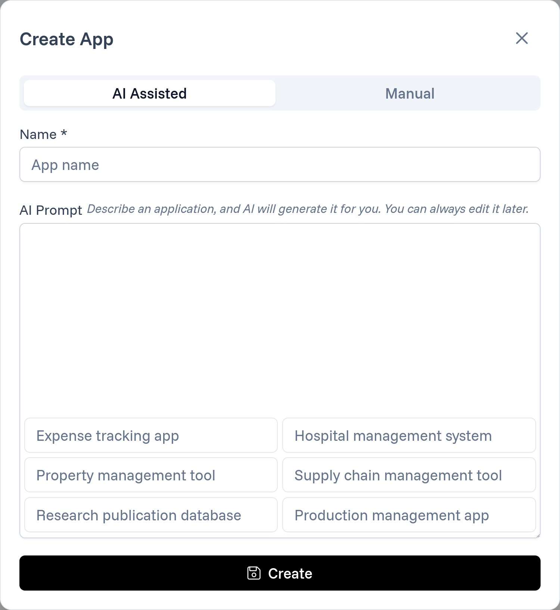

# Generating applications

First, create a free account at [app.codecannon.dev](https://app.codecannon.dev) using an accessible email address—no credit card is required.

After logging in, navigate to the **Apps** page. In the top right corner, click the prominent **Create App** button to open a modal window.

There are two ways to create an app:

- **AI Assisted:** The AI analyzes your prompt and pre-defines some modules for you.
- **Manual:** No modules are pre-defined

Once you click the **Create** button, you'll be taken to the builder page.
If you've used the AI Assistant, you'll see modules related to your prompt.
If you opted for the manual approach, you'll initially see two modules: **Blog Post** (an example module that you can delete) and **User**.
In both cases, you can modify, delete, or add modules according to your needs.

# Modifying Modules

Each module comprises two core components:

- **[Columns](https://laravel.com/docs/11.x/migrations#columns):**
  These represent the individual fields within a module. Much like database columns in Laravel, they define the structure of your module's data by specifying its data type, constraints, and default values.
  They will define the table columns and form fields in the UI.

- **[Relations (Relationships)](https://laravel.com/docs/11.x/eloquent-relationships#defining-relationships):**
  These define the associations between modules, similar to how Laravel handles model relationships. Whether it's a one-to-one, one-to-many, or many-to-many relationship, these functionalities allow modules to interact with each other in a structured and predictable way.

For developers familiar with Laravel, these concepts should be recognizable. They work as expected: creating, modifying, and deleting columns in modules as well as establishing relationships between them.

If these terms are new to you, feel free to read the Laravel documentation linked above for more detailed explanations. The following sections provide a brief introduction to these concepts within the context of codecannon, which should give you a solid foundation for building apps.

## User Interface
  **The UI is automatically generated based on the columns and relationships you define.**
  You can customize the UI by modifying the columns and relationships in the builder. We currently don't support customizing the UI directly,
  but we plan to add this feature in the future.

## Columns
 Columns are individual fields within a module that store specific pieces of data.

- **Examples:**
    - A *Product* table might have columns like:
        - `id`: The unique identifier.
        - `name`: The product name.
        - `description`: A text field for product details.
        - `price`: A numeric field with defined precision for the cost.
        - `stock`: An integer representing available inventory.

## Relationships

Relations in codecannon define how different modules are interconnected.

#### [**One-to-One:**](https://laravel.com/docs/11.x/eloquent-relationships#one-to-one)
A scenario where each record in one table corresponds to a single record in another.

*Example:* `Product` has one `Manufacturer` (Each product is produced by exactly one manufacturer.)

#### [**One-to-Many:**](https://laravel.com/docs/11.x/eloquent-relationships#one-to-many)
A scenario where a single record in one table is linked to multiple records in another.

*Example:* `Product` has many `Reviews` (A product can receive multiple reviews from different customers.)

#### [**Many-to-Many:**](https://laravel.com/docs/11.x/eloquent-relationships#many-to-many)
A scenario where records in one table can relate to multiple records in another, and vice versa.

*Example:* `Product` belongs to many `Categories`(A product can be listed in multiple categories, and each category can include multiple products.)
